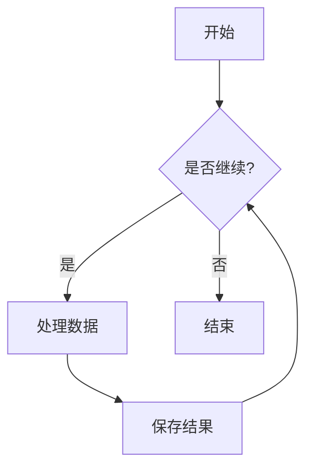

# 中文测试文档

这是一个测试文档，用于验证 Docker 镜像中的中文字体支持。

## 特性测试

1. 常规中文文本
2. **粗体中文**
3. *斜体中文*
4. `等宽字体中文`

### 列表测试

- 项目一
- 项目二
  - 子项目 A
  - 子项目 B

### 表格测试

| 列一 | 列二 | 列三 |
|------|------|------|
| 数据 | 内容 | 说明 |
| 测试 | 验证 | 结果 |

> 这是一段引用文本，测试引用样式。 

### Mermaid 图表测试



```mermaid
sequenceDiagram
    参与者A->>参与者B: 你好，B！
    参与者B->>参与者A: 你好，A！
    参与者A->>参与者C: 你好，C！
    参与者C->>参与者A: 你好，A！ 